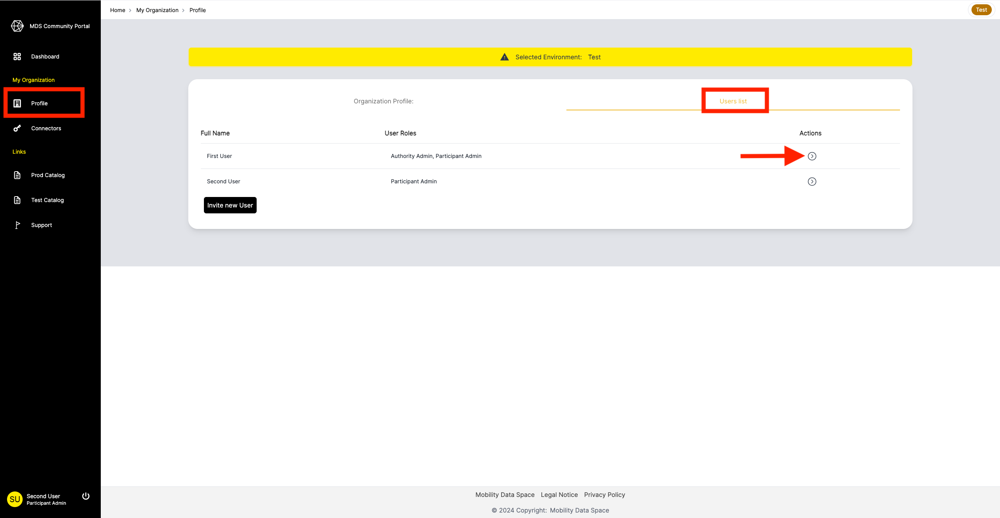
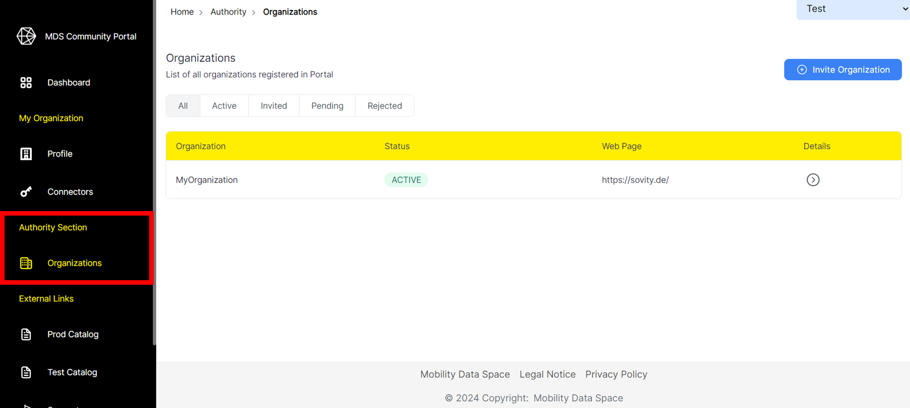
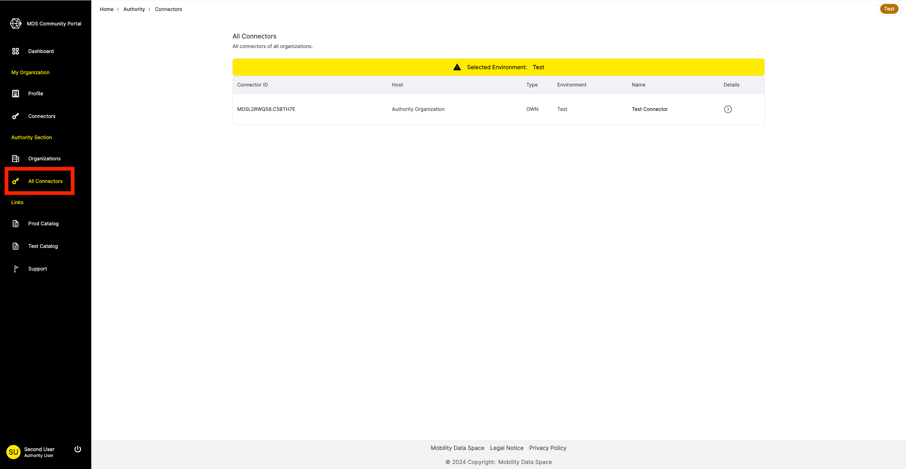

# Administration and Support

## User Management

Managing users within your organization can be done on the organization profile page.
There, click on “User list”.
The User list shows a list of all registered users in your organization.
To manage a user, click on the arrow under "Actions" next to the user.

Only Participant Admins have the rights to make changes here!
 
 
  
As a Participant Admin you are able to:

- Change the organization role of a user
- Deactivate or reactivate users

The Organization Roles are defined as follows:

- _Participant User_: The basic role that allows a person to open multiple participant related sections in the MDS Portal, but basically cannot change anything
- _Participant Curator_: The role allows creating and editing connectors for the user's organization
- _Participant Admin_: Can additionally manage users, invite new users and deactivate existing users

## Organization management

Organization management is only available to Authority Admins and Authority Users. If you have one of these application roles you can see the Authority section on the navigation bar. 

 
On the Organization page you can see all organizations registered in the MDS Portal. They can be sorted by:

- _Active_: Fully registered organizations
- _Invited_: Organization invitation has been sent, but was not yet accepted
- _Pending_: Organization has send a registration request
- _Rejected_: Organization registration request has been rejected

Click the arrow next to an organization to view the organization profile and the user list.

As an Authority User you have the rights to:

- See the list of all registered, pending & invited organizations
- Invite new organizations and their first user, the Participant Admin
- Accept & reject pending requests 
- Access any organization's profile

As an Authority Admin you can additionally:

  - Manage application roles (Authority Admin/User, Service Partner and Operator) of users of any organization via the user list of each organization

## Connector overview

Under "All Connectors", Authority Users and Admins can see all registered connectors of all organizations in the MDS Portal.
Also, the connector details can be accessed from here.

## Ticket System

In case of any need for support, e.g. when encountering malfunctions, problems finding information or questions regarding the provided information, click on “Support” to access the Fault Management system.
Find further documentation [here](https://mobility-dataspace.online/).