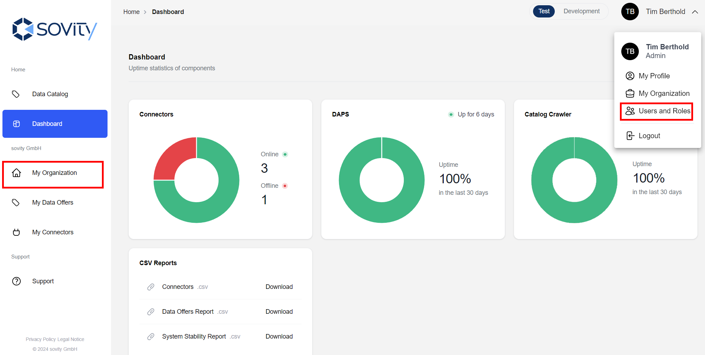

# Administration and Support

## Profile & Roles

A user can see their profile by clicking on their name in the top right corner and then "My Profile".

Any user is able to edit their own information by maneuvering to his own profile and clicking "Edit".
First name, last name, job title, email and phone number can be updated and changes persisted by clicking "Update".

Also, a user can see the roles assigned to him/her by clicking on the Tab "Users and Roles".
As a participant in the AP, you can have one of the following roles:

- _User_: The basic role that allows a person to open multiple participant related sections in the AP, but basically cannot change anything
- _Key User_: The role allows creating and editing connectors for the user's organization
- _Admin_: Can additionally manage users, invite new users and deactivate existing users

## User Management

To manage the users in your organization, maneuver to the list of users by

a) clicking on your name in the top right corner and then "Users and Roles"
or b) Click on "My Organization" and then "Users and Roles"

The "User & Roles" list shows a list of all registered members in your organization.
To manage a user, click somewhere in the row the user of interest is listed in.

Only Admins have the rights to make changes here!

As an Admin you are able to:

- Change user roles (via user details)
- Delete, deactivate or reactivate users (via user details)
- Invite new users to your organization

### User Invitation

As described above, to invite new users into your organization, you must have the role Admin!
New users can be invited by clicking on "Invite User".

Specify the user's name, email and role.
Click on "Send invitation" to add the user to the list of registered users.

The invited user will receive an invitation email with a link.
When clicking the link, the user will be asked to set a password for their account and to set up two-factor authentication.

## Dashboard & Reporting

The Dashboard provides an overview over the current status of central Data Space Components as well as the organization's connectors.
Also, it is possible to download reports about connectors, data offers and system stability from here.

## Ticket System

In case of any need for support, e.g. when encountering malfunctions, problems finding information or questions regarding the provided information, click on “Support” to access the Support ticketing system.
