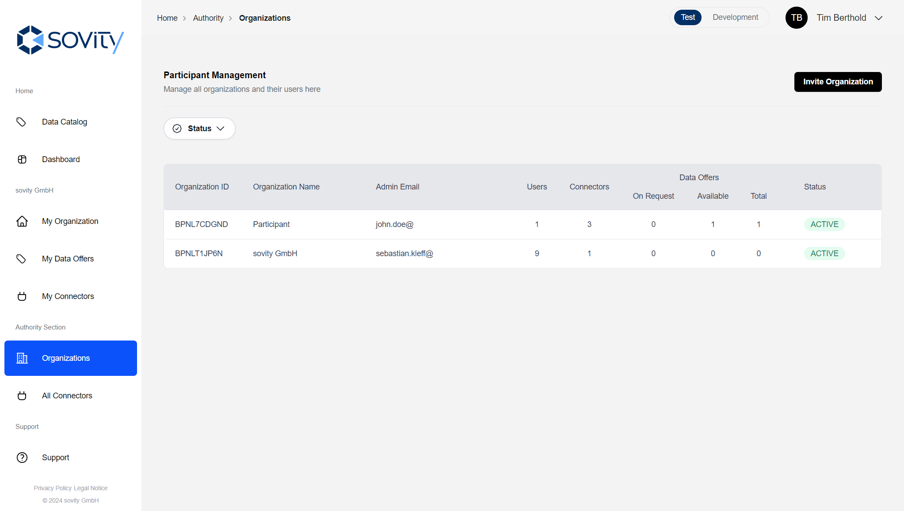
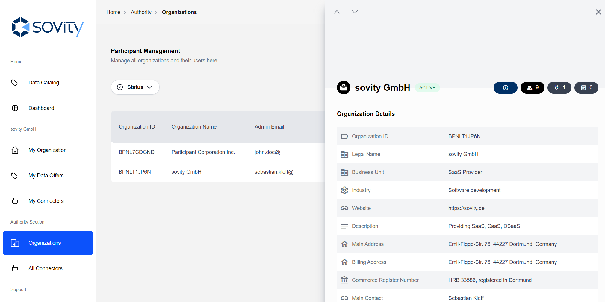

# Authority Section

## Organization management

Organization management is only available to Authority Admins and Authority Users. If you have one of these application roles you can see the Authority section on the navigation bar.

On the Organization page you can see all organizations registered in the Authority Portal. They can be filtered by:

- _Active_: Fully registered organizations
- _Invited_: Organization invitation has been sent, but was not yet accepted
- _Onboarding_: The Admin of an invited organization has already logged-in at least once and needs to fill in organization details
- _Pending_: Organization has sent a registration request
- _Rejected_: Organization registration request has been rejected

Click in the row of an organization to view the organization details. Quickly switch between two organization detail pages by using the arrows at the top left of the details view.

From the organization detail page, Authority Users and Admins are able to manage the organization of interest and e.g. approve or reject an organization or see the different users of it.

As an Authority User you have the rights to:

- See the list of all registered, pending & invited organizations
- Invite new organizations and their respective initial Admin
- Accept & reject pending organizations' requests
- Access any organization's profile

As an Authority Admin you can additionally:

- Manage application roles (Authority Admin/User, Service Partner and Operator) of users of any organization via the user list of each organization

### Organization invitation

Organizations can be invited by Authority Users and Authority Admins.
The process is as follows:

1. In the organization list, click on "Invite Organization".
2. Fill out the form with the organization details and the first user's details.
3. Submit the form. An email will be sent to the first user with a link to the user registration process.

## Connector overview

Under "All Connectors", Authority Users and Admins can see all registered connectors of all organizations in the Authority Portal.
Also, the connector details can be accessed from here.

Additionally, the status of each connector is displayed, providing insights into their current operational state. Each Connector can have the following statuses:
- Online: The connector is reachable and operational.
- Offline: The connector is not reachable by the Authority Portal crawler.

Connectors of type CAAS (Connector as a Service) can also support extended operational statuses. These additional statuses provide more granular insights into the state of Connector as a Service Connectors, reflecting their dynamic and managed nature.
- Init: The connector is in the initialization process.
- Provisioning: The connector is being set up and is not yet available for use.
- Deprovisioning: The connector is being decommissioned or removed.
- Error: An issue has occurred that requires attention.
- Unknown: Connector has been deleted via other systems and no longer exists. 

In rare cases, additional statuses may appear, reflecting specific scenarios or exceptions in the system's operation.

## Dashboard & Reporting

Additionally Authority Users and Admins have access to the following features on the Dashboard:

- They can download a report about all users and their roles.
- Instead of only their own, all connectors are respected in the connector report.
- Instead of only their own, they see the status of all connectors.
