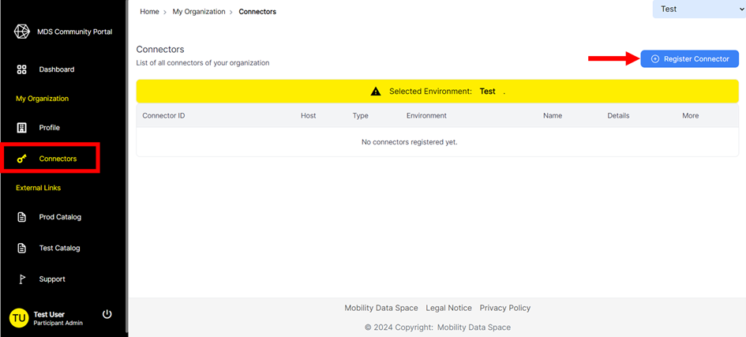
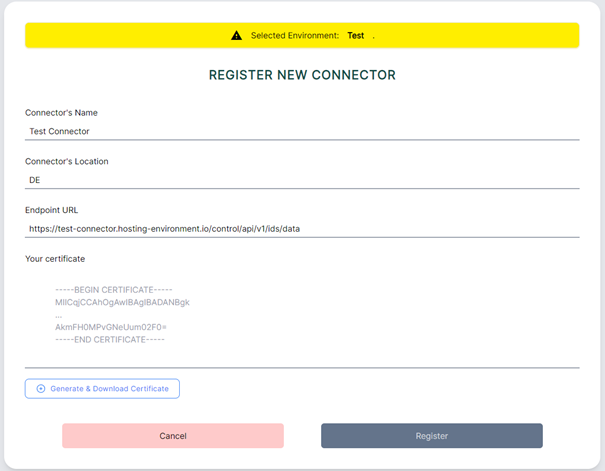
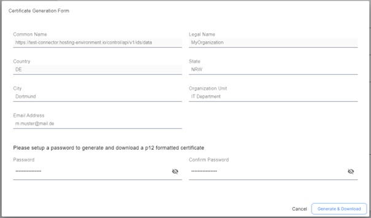
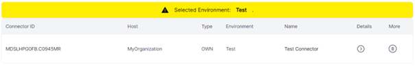

# Connect to the MDS
The Eclipse Dataspace Components (EDC) Connector is the key component for connecting to the MDS and providing and consuming data. There are two options to access to the MDS with:
-	Connector-as-a-Service (CaaS)
-	On-premise installation
## Connector-as-a-Service
The CaaS is the simplest way to receive a registered and compliant connector. More information on the CaaS can be found [here](https://github.com/Mobility-Data-Space/mobility-data-space/wiki/).

## On-premise installation
The installation of an on-premise connector consists of two steps:
1.	Issue a certificate
2.	Set up and configure the connector

### 1. Issue a certificate
To configure and deploy a connector a certificate is required. Therefore the on-promise installation starts with issuing a certificate, which is done via the Authority Portal.

Visit the Connectors page in the Authority Portal and click on “Register Connector”.
 

Fill out the registration-mask. Make sure to provide the correct connector endpoint URL.
Example Endpoint URL:  https://test-connector.hosting-environment.io/control/api/v1/ids/data
 

Click on “Generate & Download Certificate”.
Fill out the certificate generation form. All fields are mandatory.

 
Click on “Generate & Download” to receive the certificate. The certificate will automatically be attached to the connector registration process. Click on “Register” to finalize the connector registration process.

The Connectors page should now display the registered connector. 

 

### 2. Setup and configurate the connector
We recommend to use the MDS Version of the Eclipse Dataspace Connector, which is used as reference for configuration. Nevertheless, you can use any other connector which is compatible with the EDC, MDS Catalog and MDS Clearing House.

A deployment guide for self-hosting a functional MDS CE EDC Connector can be found on the  under Connector On-Premise - 2. Step (Configuration).

