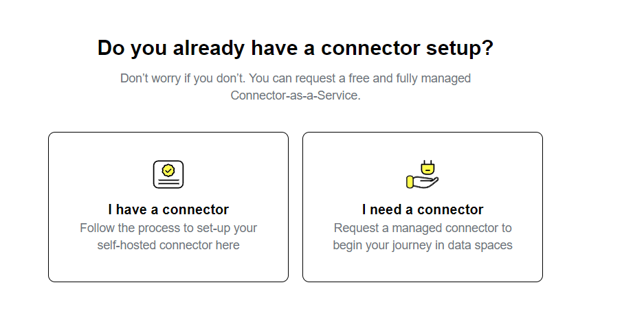
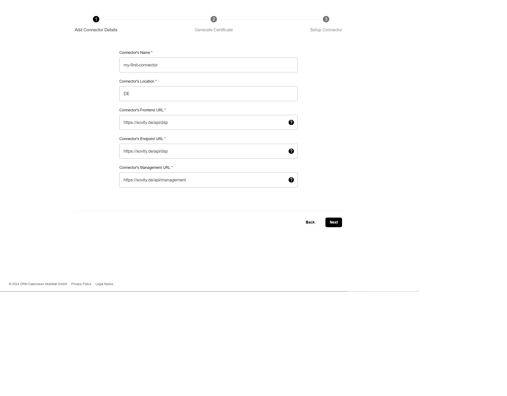
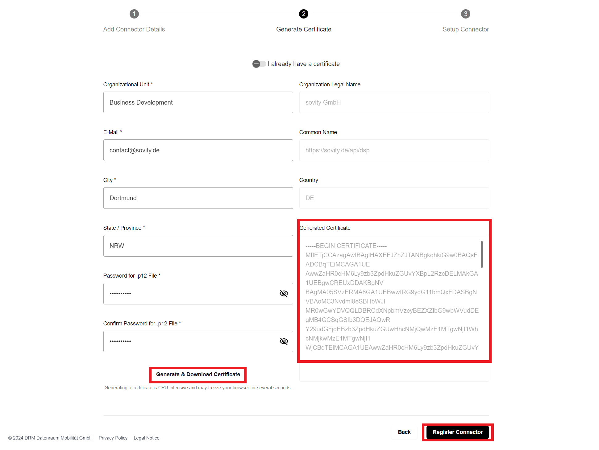
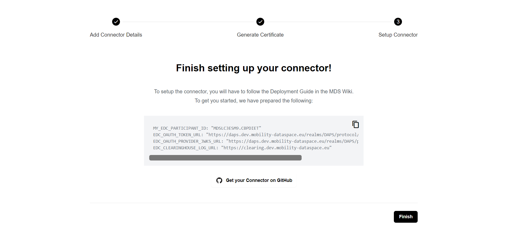
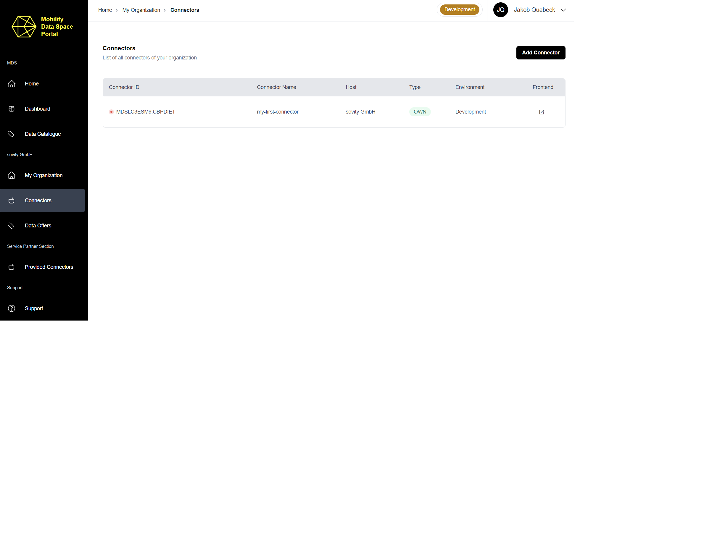

# Connect to the MDS

The Eclipse Dataspace Components (EDC) Connector is the key component for connecting to the MDS and providing and consuming data.
There are two options to access the MDS with:

- Connector-as-a-Service (CaaS)
- On-premise installation

## Connector-as-a-Service

The CaaS is the simplest way to receive a registered and compliant connector.
More information on the CaaS can be found [here](https://github.com/Mobility-Data-Space/mobility-data-space/wiki/).

## On-premise installation

The installation of an on-premise connector consists of two steps:

1. Register your connector 
2. Set up and configure the connector

### 1. Register your connector

If you seek to add a Connector to your organization in the MDS, click "Add Connector" and select if you already have a Connector or need a Connector.

Fill out the "Add Connector Details"-mask and click "Next" to proceed.

After entering your Connector details, you now need to give the stated information in the "Generate Certificate"-mask. and click "Generate & Download Certificate".

The certificate will automatically be filled into the respective field in the registration form and the download will be triggered.
Click on “Register Connector” to finalize the connector registration process.

On the following page you will find further instructions on how to set up your on-premise Connector and a link to the open-source repository edc-extensions providing all you need to set up your Connector.

Find your newly registered Connector in the "Connectors" list.

### 2. Setup and configure the connector

We recommend using the MDS version of the Eclipse Dataspace Connector, which is used as reference for configuration. Nevertheless, you can use any other connector which is compatible with the EDC, MDS Catalogue and MDS Logging House.

A deployment guide for self-hosting a functional MDS CE EDC Connector can be found in the [MDS Wiki](https://github.com/Mobility-Data-Space/mobility-data-space/wiki) under Connector On-Premise - 2. Step (Configuration).

