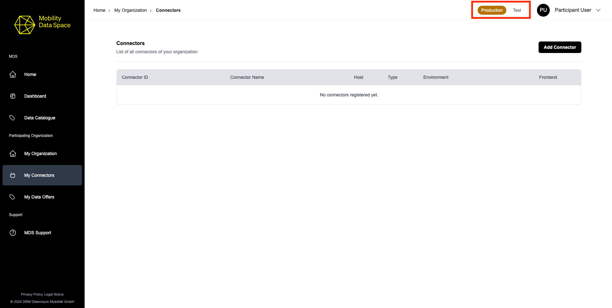
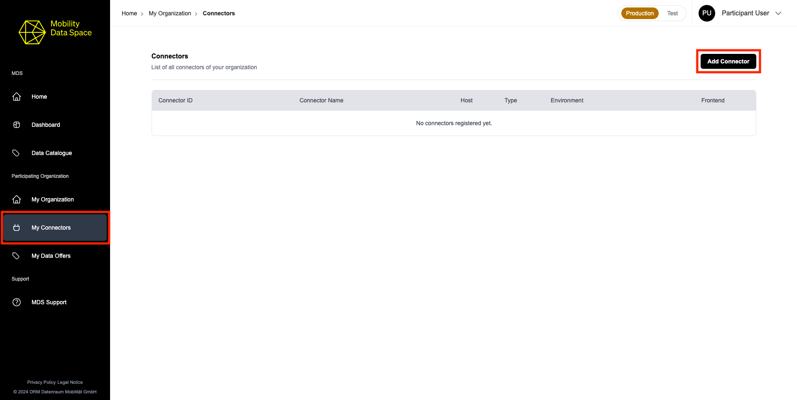
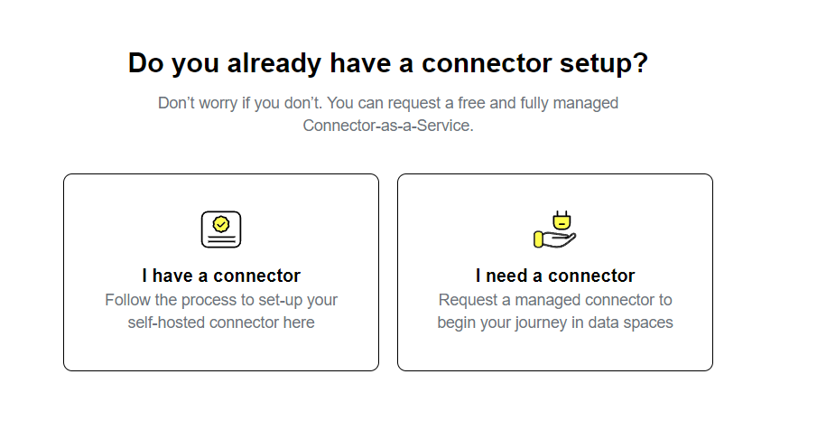
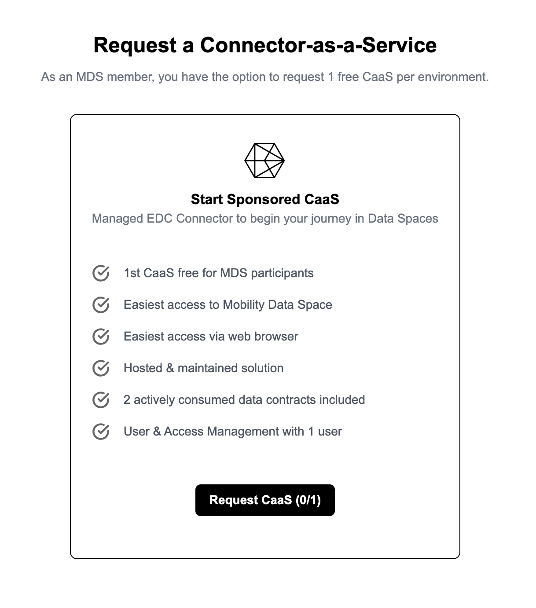
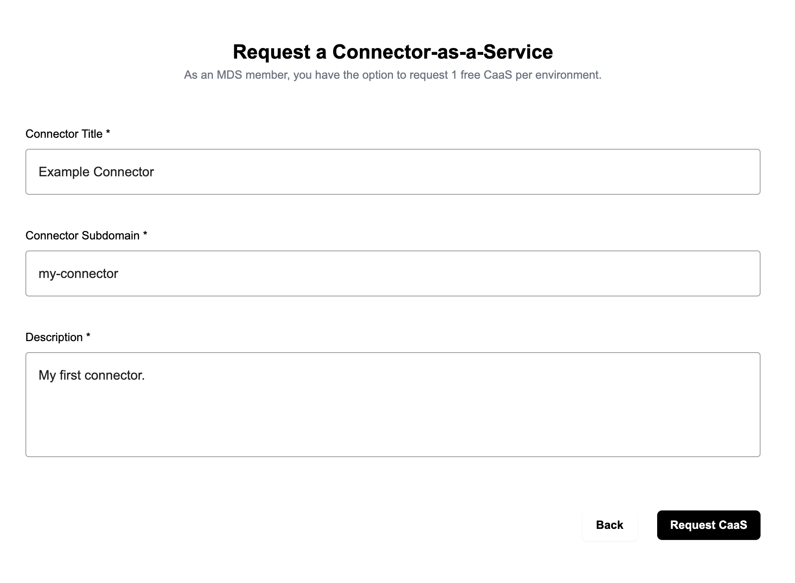
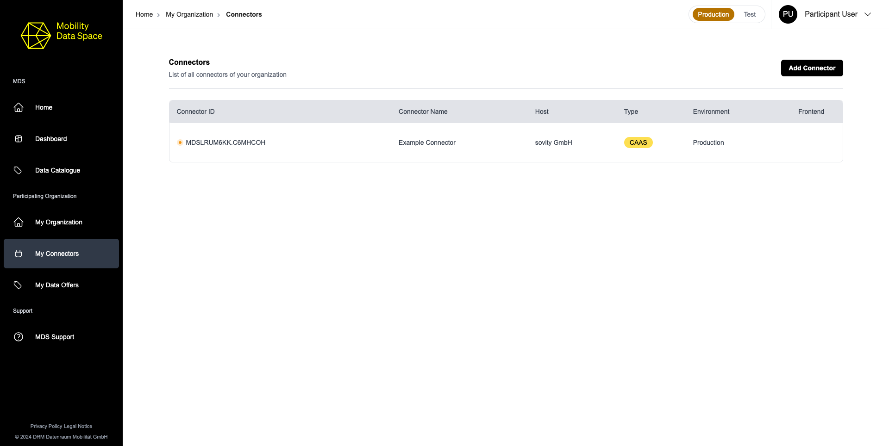
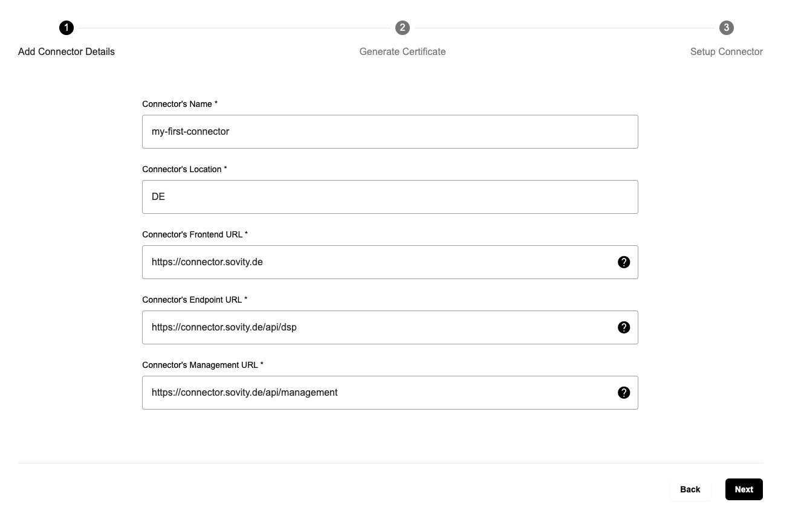
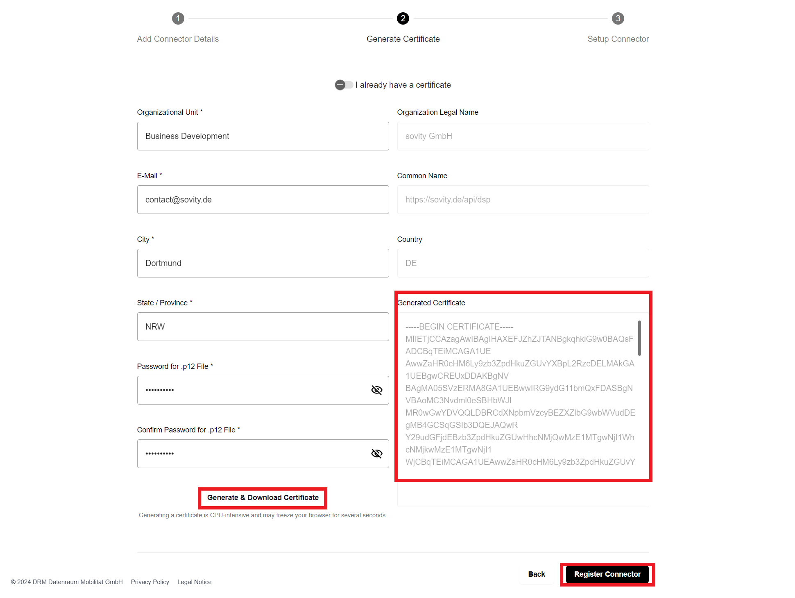
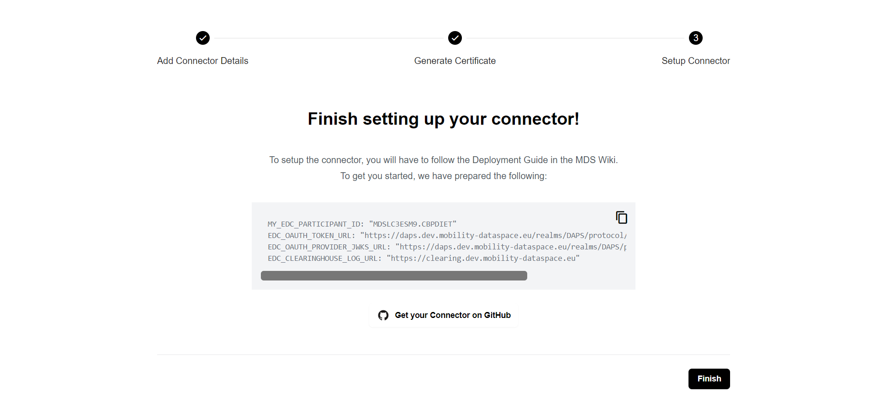
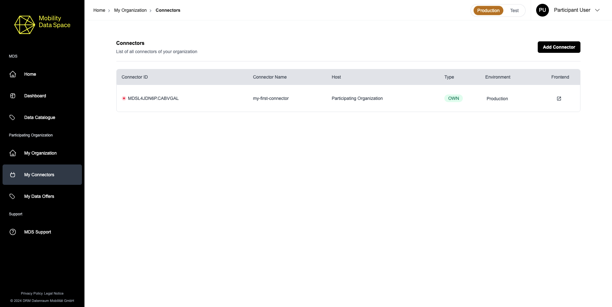

# Connect to the MDS

## Environments

The MDS Portal provides different deployment environments for you to use.
Environments can be switched via the selector in the top bar of the MDS Portal.

The selection is global and affects all areas of the portal that deal with connectors.
Also, the amount of free CaaS is limited per environment.

## Connectors

The Eclipse Dataspace Components (EDC) Connector is the key component for connecting to the MDS and providing and consuming data.
There are two options to access the MDS with:

- Connector-as-a-Service (CaaS)
- On-premise installation

### Connector-as-a-Service

The CaaS is the simplest way to receive a registered and compliant connector.

If you seek to add a CaaS to your organization in the MDS, click "Add Connector".

Select "I need a connector".

In case the amount of free connectors for the selected environment is not exceeded, you will be able to proceed with the registration.

Fill out the CaaS details and click "Request CaaS".

After the registration, you will find your newly registered CaaS in the "Connectors" list.
The provisioning process of your new connector may take some time and the current status can be tracked in the connector details.

### On-premise installation

The installation of an on-premise connector consists of two steps:

1. Register your connector 
2. Set up and configure the connector

#### 1. Register your connector

If you seek to add a Connector to your organization in the MDS, click "Add Connector".

Select "I have a connector".

Fill out the "Add Connector Details" form and click "Next" to proceed.

After entering your Connector details, you now need to give the stated information in the "Generate Certificate" form and click "Generate & Download Certificate".

The certificate will automatically be filled into the respective field in the registration form and the download will be triggered.
Click on “Register Connector” to finalize the connector registration process.

On the following page you will find further instructions on how to set up your on-premise Connector and a link to the open-source repository edc-ce (sovity EDC Community Edition) providing all you need to set up your Connector.

Find your newly registered Connector in the "Connectors" list.

#### 2. Setup and configure the connector

We recommend using the MDS version of the Eclipse Dataspace Connector, which is used as reference for configuration. Nevertheless, you can use any other connector which is compatible with the EDC, MDS Catalogue and MDS Logging House.

A deployment guide for self-hosting a functional MDS CE EDC Connector can be found in the [MDS Wiki](https://github.com/Mobility-Data-Space/mobility-data-space/wiki) under Connector On-Premise - 2. Step (Configuration).

