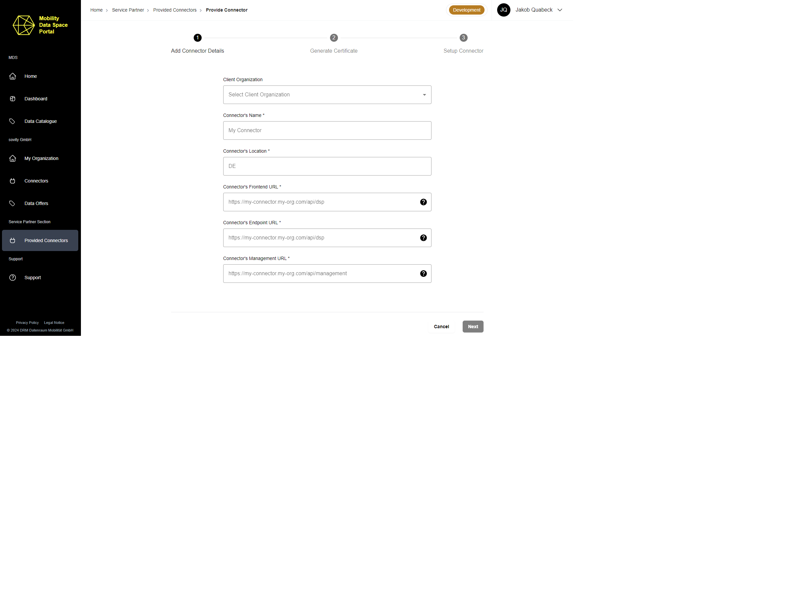
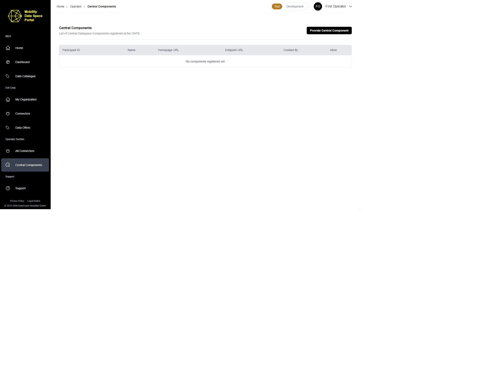
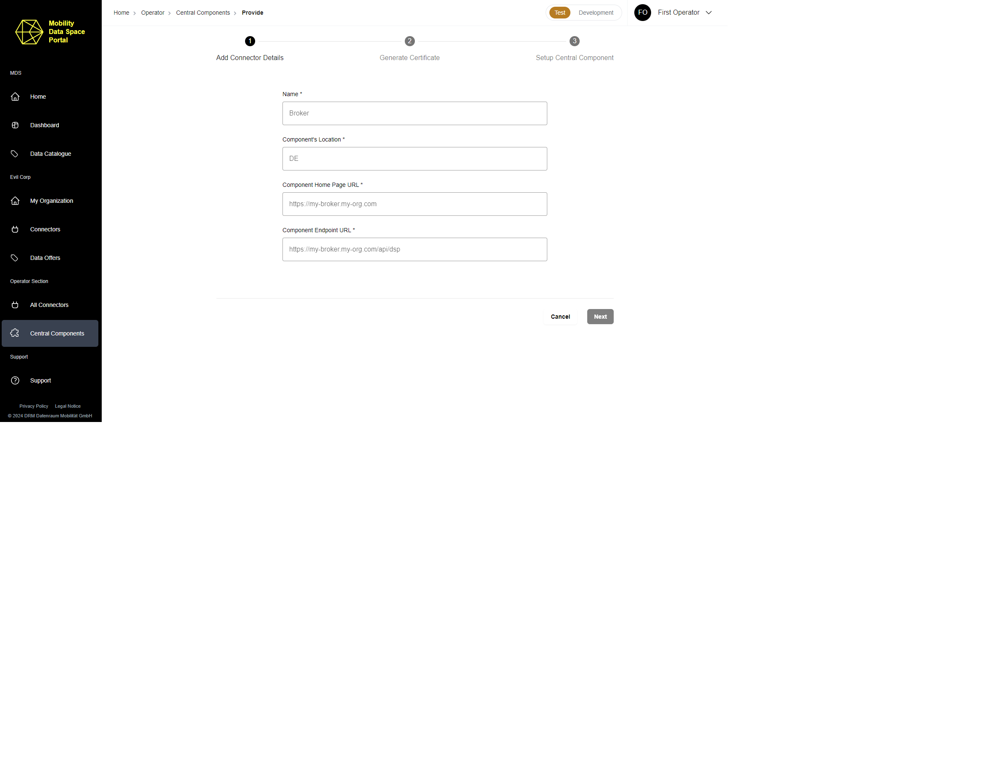

# Manage the Data Space components

Besides the Data Space Authority roles, there are two other application roles that are able to manage elements of the Data Space.

  - Service Partner Admin
  - Operator Admin

## Application role: Service Partner Admin

### General

The Service Partner Admin is an application role to represent the provider of connectors of the Mobility Data Space. A service partner of the Mobility Data Space provides connectors for Data Space participants by deploying and registering these connectors for other entities within the Data Space.
As such, the service partner has direct access to all provided connectors and the application role of Service Partner Admin aims to mirror those capabilities within the MDS Portal.
The Service Partner Admin role is an application role and assigned to certain users individually by Authority Admins.

### Rights for Service Partner Admins

Currently, the Service Partner Admin role grants the following rights in addition to a user's organization role:

1. View a list of provided connectors
2. Provide and delete provided connectors
3. Assign Service Partner Admin role to users within own organization

#### 1. View a list of provided connectors

As a Service Partner Admin a user is able to access the "Provided Connectors" page where all provided connectors are displayed.

#### 2. Register and delete connectors

When clicking on the button "Provide Connector" in the upper right corner a mask to register a new connector opens.

To provide a connector in the MDS Portal all fields of the mask must be submitted. The process is identical to the registration of connectors for users without any application role but registers the connector for another organization who is named in the slightly changed registration mask.
After clicking on the register button the list of provided connectors appears, where the added connector can be found.

#### 3. Assign Service Partner Admin role to users within own organization

Click on "My Organization" in the sidebar menu.
Head to the "Users & Roles" page.
Select a user's profile of the user that shall become a Service Partner Admin.
Edit the application role and change it to Service Partner Admin.
Result: An additional Service Partner Admin has been created.

## Application role: Operator Admin

### General

The Operator Admin is an application role to represent the operator of the Mobility Data Space. The operator of the Mobility Data Space deploys the central components of the Data Space in the infrastructure and manages the different environments of the Data Space. As such, the operator has direct access to all central components and the application role of Operator Admin aims to mirror those capabilities within the MDS Portal.
The Operator Admin role is an application role and assigned to certain users individually by Authority Admins.

### Rights for Operator Admins

Currently, the Operator Admin role grants the following rights in addition to a user's organization role:

1. View a list of central components
2. Register and delete central components
3. Assign Operator Admin role to users within own organization

#### 1. View a list of central components

As an Operator Admin a user is able to access the "Central Components" page where all registered central components are displayed.

#### 2. Register and delete central components

When clicking on the button "Provide Central Component" in the upper right corner a mask to register a central component opens.

To register a central component in the MDS Portal all fields of the mask must be submitted. The process is identical to the registration of connectors but does not register the added central component at the MDS Broker.
After clicking on the register button the list of central components appears, where the added central component can be found.

#### 3. Assign Operator admin role to users within own organization

1. Click on "My Organization" in the side bar menu.
2. Head to the "Users & Roles" page.
3. Select a user's profile of the user that shall become an Operator Admin.
4. Edit the application role and change it to Operator Admin.
5. Result: An additional Operator Admin has been created.
