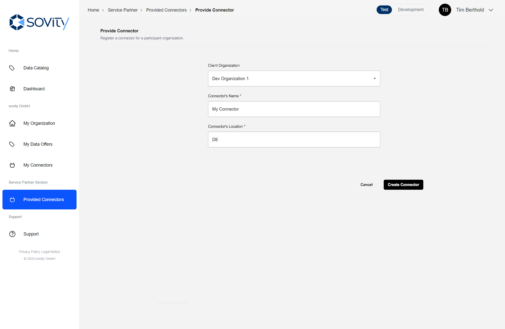

# Manage the Data Space components

Besides the Data Space Authority roles, there are two other application roles that are able to manage elements of the Data Space.

- Service Partner Admin
- Operator Admin

## Application role: Service Partner Admin

### General

The Service Partner Admin is an application role to represent the provider of connectors in a Data Space. A service partner of a Data Space provides connectors for Data Space participants by deploying and registering these connectors for other entities within the Data Space.
As such, the service partner has direct access to all provided connectors and the application role of Service Partner Admin aims to mirror those capabilities within the Authority Portal.
The Service Partner Admin role is an application role and assigned to certain users individually by Authority Admins.

### Rights for Service Partner Admins

Currently, the Service Partner Admin role grants the following rights in addition to a user's organization role:

1. View a list of provided connectors
2. Provide and delete provided connectors
3. Assign Service Partner Admin role to users within own organization

#### 1. View a list of provided connectors

A Service Partner Admin is able to access the "Provided Connectors" page, where all provided connectors are displayed. On this page, connectors are categorized by their types. The types of connectors include:
- Own: Connectors registered and maintained directly by the organization.
- Provided: Connectors supplied by a third-party service partner.
- CaaS: Connector as a Service - Managed connectors.
- Configure Button: The Connector needs further configuration for being set up.

#### 2. Register and delete connectors

When clicking on the button "Provide Connector" in the upper right corner a mask to register a new connector opens.

To provide a connector in the Authority Portal all fields of the mask must be submitted.
After clicking on the "Create Connector" the list of provided connectors appears, where an added connector can be found which has to be configured further at some point in time.

By clicking in the list on "Configure", the additional data for the connector must be entered, such as the URL at which the frontend of the connector can be accessed.
The most important entry  is the connector endpoint, the DSP-endpoint, so that the connector's offers can be searched and displayed in the authority portal, since the authority portal also crawls the connectors in the dataspace for available offers which the authority portal's crawler is allowed to access.
The process of the further configuration guides you through the necessary steps and needed information to specify the URLs or enter valid information about the connector certificate.
Please follow the steps in the dialog.

#### 3. Assign Service Partner Admin role to users within own organization

1. Click on "My Organization" in the sidebar menu.
2. Head to the "Users and Roles" page.
3. Select a user's profile of the user that shall become a Service Partner Admin.
4. Edit the application role and change it to Service Partner Admin.
5. Result: An additional Service Partner Admin has been created.

## Application role: Operator Admin

### General

The Operator Admin is an application role to represent the operator of the Mobility Data Space. The operator of the Mobility Data Space deploys the central components of the Data Space in the infrastructure and manages the different environments of the Data Space. As such, the operator has direct access to all central components and the application role of Operator Admin aims to mirror those capabilities within the Authority Portal.
The Operator Admin role is an application role and assigned to certain users individually by Authority Admins.

### Rights for Operator Admins

Currently, the Operator Admin role grants the following rights in addition to a user's organization role:

1. View a list of central components and all connectors
2. Register and delete central components
3. Assign Operator Admin role to users within own organization

#### 1. View a list of central components

As an Operator Admin a user is able to access the "Central Components" page where all registered central components are displayed.

#### 2. Register and delete central components

When clicking on the button "Provide Central Component" in the upper right corner a mask to register a central component opens.

To register a central component in the Authority Portal all fields of the mask must be submitted.
After clicking on the register button the list of central components appears, where the added central component can be found.

#### 3. Assign Operator Admin role to users within own organization

1. Click on "My Organization" in the sidebar menu.
2. Head to the "Users and Roles" page.
3. Select a user's profile of the user that shall become an Operator Admin.
4. Edit the application role and change it to Operator Admin.
5. Result: An additional Operator Admin has been created.
