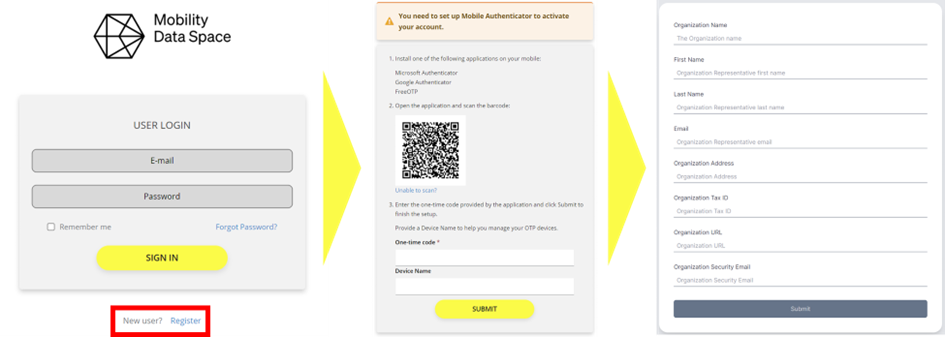
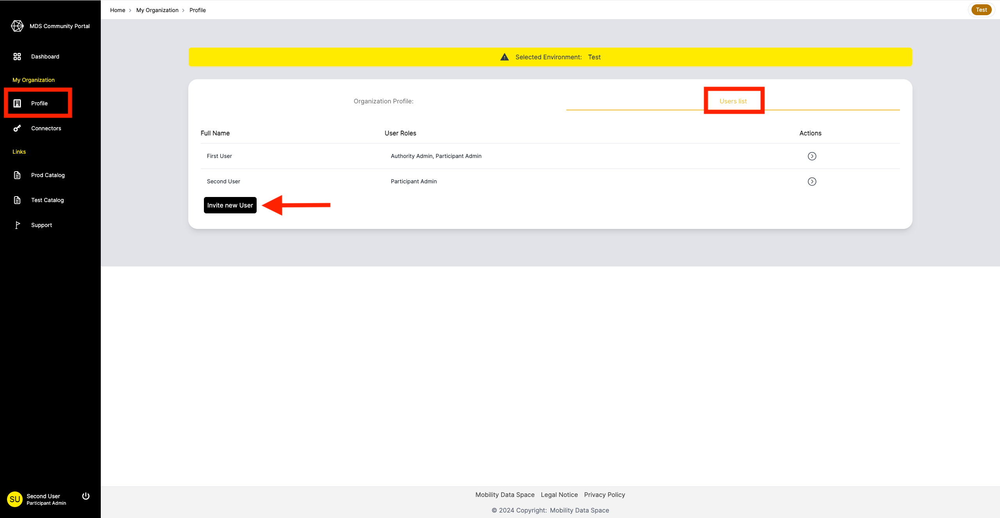

# Registration in the MDS Portal

## User Registration

Registration to the MDS as a user can be done on two ways:

- Self-registration 
- By receiving an invitation

### Self-registration

Self-registration is only suitable for the first user of an organization within the MDS Portal. 
Start the process in the MDS Portal.
Click on “Register” and follow the registration process.
You will be asked to provide information about the user and the organization.
You will not be able to edit this information later!

After you finish entering your user information, you will receive a verification email.

Once received, click on the verification link in the email and wait for your organization to be approved or rejected by the Data Space Authority.

### Invitation

Within the MDS Portal, the organization profile page provides an overview of your organization's information and by clicking on “User list”, it displays a list of all registered users in your organization.
From there, you can invite new users to your organization.

To invite new users into your organization, you must have the role Participant Admin!

Click on "Invite new User" and specify the user's name, email and role.
Click on "Submit" to add the user to the list of registered users.

The invited user will receive an invitation email with a link.
When clicking the link, the user will be asked to set a password for their account and to add two-factor authentication.

## Organization registration

There are two ways to register in the MDS as an organization:

- Self-registration (see User registration – Self-registration)
- Invitations

### Organization invitations

Invitations for organizations can only be sent by the Data Space Authority (MDS). 
The process is as follows:

1. The Data Space Authority (MDS) sends an organization invitation to an organization representative. 
2. The organization representative receives an e-mail with a link to the user registration process (see User Self-Registration).

The organization representative invited by the MDS will automatically be accepted and assigned with the Participation_Admin role.
