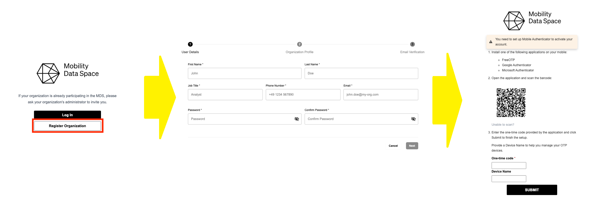

# Registration in the MDS Portal

## Organization Registration

If your organization is not yet registered in the MDS Portal, there are two possibilities to get started.

### Invitation

The first option is to receive an invitation from the Data Space Authority (MDS).
This would be an email invitation to the organization representative, which will contain a link to the registration process.

### Self-registration

The other option is to register your organization yourself.
To do so, click on “Register Organization” in the MDS Portal and follow the registration process.
During this process, you will be asked to provide information about the organization and the user who will be the organization representative.

After you finish entering your user and organization details, you will receive a verification email including the finalization of your account by setting up a two-factor authentication.

Once received, click on the verification link in the email and wait for your organization to be approved or rejected by the Data Space Authority.

## User Registration

If your organization is already registered in the MDS Portal, you can register as a user by receiving an invitation from an organization Admin.
Therefore, please ask one of your Admins to send you an invitation.
The user invitation process is described at the [User Invitation section](Administration%20and%20Support.md#user-invitation) in "Administration & Support"

## The Portal

After finishing the registration process, you will be able to log in to the MDS Portal.
Depending on your role, you will have access to different sections and functionalities.
In general this includes the management of your connectors, organization and users.